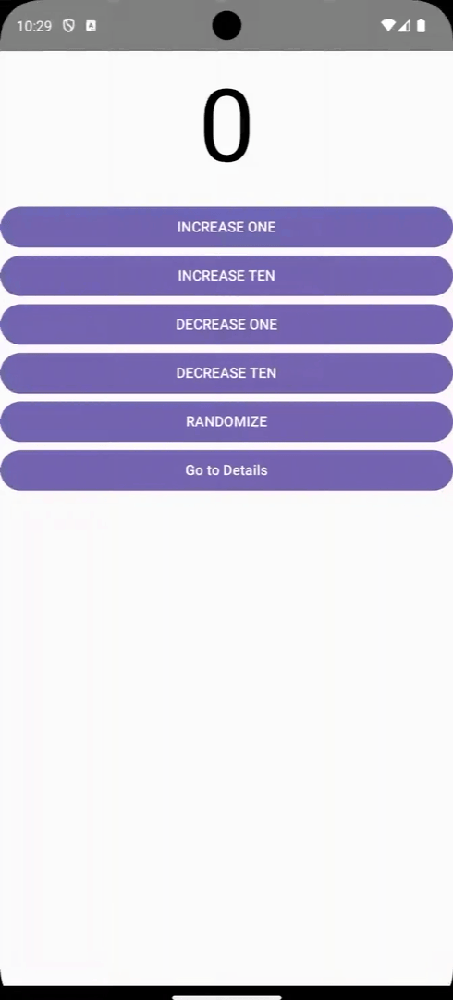

<h1 align="center">
    Jetpack-Compose-Circuit-Demo
</h1>

<h3 align="center">
    
</h3>


## ✨Features

This application has next features.

- Count numbers.
- Randomize numbers.

## 🏢Implementation

This application is implemented by Circuit.

https://slackhq.github.io/circuit/ 

### Home

#### Screen

```kotlin
@Parcelize
data object HomeScreen : Screen {
    data class State(
        val value: Int = 0,
        val loading: Boolean = false,
        val eventSink: (Event) -> Unit,
    ) : CircuitUiState

    sealed class Event : CircuitUiEvent {
        data class Change(
            val delta: Int,
        ) : Event()

        data object Randomize : Event()

        data object GoToDetails : Event()
    }
}
```

#### Presenter

```kotlin
class HomePresenter(
    private val navigator: Navigator,
    private val randomService: RandomService,
) : Presenter<HomeScreen.State> {
    @Composable
    override fun present(): HomeScreen.State {
        val scope = rememberCoroutineScope()
        var count by rememberSaveable { mutableIntStateOf(0) }
        var loading by rememberSaveable { mutableStateOf(false) }

        return HomeScreen.State(
            value = count,
            loading = loading,
        ) { event ->
            when (event) {
                is HomeScreen.Event.Change -> {
                    count = event.delta
                }
                HomeScreen.Event.Randomize -> {
                    scope.launch {
                        loading = true
                        count = randomService.get(-20, 20)
                        loading = false
                    }
                }

                HomeScreen.Event.GoToDetails -> {
                    navigator.goTo(DetailsScreen(count))
                }
            }
        }
    }

    class Factory(
        private val randomService: RandomService,
    ) : Presenter.Factory {
        override fun create(
            screen: Screen,
            navigator: Navigator,
            context: CircuitContext,
        ): Presenter<*>? {
            return when (screen) {
                is HomeScreen -> return HomePresenter(navigator, randomService)
                else -> null
            }
        }
    }
}
```

#### ViewContent

```kotlin
@Composable
fun HomeViewContent(
    state: HomeScreen.State,
    modifier: Modifier = Modifier,
) {
    Column(modifier) {
        Box(
            modifier =
                Modifier
                    .fillMaxWidth()
                    .size(150.dp)
                    .align(Alignment.CenterHorizontally),
        ) {
            if (state.loading) {
                CircularProgressIndicator(
                    modifier =
                        Modifier
                            .size(100.dp)
                            .align(Alignment.Center),
                )
            } else {
                Text(
                    text = state.value.toString(),
                    fontSize = 100.sp,
                    textAlign = TextAlign.Center,
                    modifier =
                        Modifier
                            .fillMaxWidth()
                            .align(Alignment.Center),
                )
            }
        }

        Button(
            onClick = { state.eventSink(HomeScreen.Event.Change(state.value + 1)) },
            modifier = Modifier.fillMaxWidth(),
        ) {
            Text(text = "INCREASE ONE")
        }

        Button(
            onClick = { state.eventSink(HomeScreen.Event.Change(state.value + 10)) },
            modifier = Modifier.fillMaxWidth(),
        ) {
            Text(text = "INCREASE TEN")
        }

        Button(
            onClick = { state.eventSink(HomeScreen.Event.Change(state.value - 1)) },
            modifier = Modifier.fillMaxWidth(),
        ) {
            Text(text = "DECREASE ONE")
        }

        Button(
            onClick = { state.eventSink(HomeScreen.Event.Change(state.value - 10)) },
            modifier = Modifier.fillMaxWidth(),
        ) {
            Text(text = "DECREASE TEN")
        }

        Button(
            onClick = { state.eventSink(HomeScreen.Event.Randomize) },
            modifier = Modifier.fillMaxWidth(),
        ) {
            Text(text = "RANDOMIZE")
        }

        Button(
            onClick = { state.eventSink(HomeScreen.Event.GoToDetails) },
            modifier = Modifier.fillMaxWidth(),
        ) {
            Text(text = "Go to Details")
        }
    }
}
```

### Details 

#### Screen

```kotlin
@Parcelize
data class DetailsScreen(
    val value: Int,
) : Screen {
    data class State(
        val value: Int = 0,
        val eventSink: (Event) -> Unit,
    ) : CircuitUiState

    sealed class Event : CircuitUiEvent {
        data object Back : Event()
    }
}
```

#### Presenter

```kotlin
class DetailsPresenter(
    private val navigator: Navigator,
    private val screen: DetailsScreen,
) : Presenter<DetailsScreen.State> {
    @Composable
    override fun present(): DetailsScreen.State =
        DetailsScreen.State(value = screen.value) {
            when (it) {
                DetailsScreen.Event.Back -> navigator.pop()
            }
        }

    class Factory : Presenter.Factory {
        override fun create(
            screen: Screen,
            navigator: Navigator,
            context: CircuitContext,
        ): Presenter<*>? {
            return when (screen) {
                is DetailsScreen -> return DetailsPresenter(navigator, screen)
                else -> null
            }
        }
    }
}
```

#### ViewContent

```kotlin
@Composable
fun DetailsViewContent(
    state: DetailsScreen.State,
    modifier: Modifier = Modifier,
) {
    Column(modifier) {
        Box(
            modifier =
                Modifier
                    .fillMaxWidth()
                    .size(150.dp)
                    .align(Alignment.CenterHorizontally),
        ) {
            Text(
                text = state.value.toString(),
                fontSize = 100.sp,
                textAlign = TextAlign.Center,
                modifier =
                    Modifier
                        .fillMaxWidth()
                        .align(Alignment.Center),
            )
        }

        Button(
            onClick = { state.eventSink(DetailsScreen.Event.Back) },
            modifier = Modifier.fillMaxWidth(),
        ) {
            Text(text = "Back")
        }
    }
}
```

### Model(HTTP Client)

```kotlin
interface RandomApi {
    @GET("integers/?num=1&col=1&base=10&format=plain")
    suspend fun get(
        @Query("min") min: Int,
        @Query("max") max: Int,
    ): String
}

interface RandomService {
    suspend fun get(min: Int, max: Int): Int
    companion object {
        fun create(): RandomService {
            val retrofit = Retrofit.Builder()
                .baseUrl("https://www.random.org/")
                .client(
                    OkHttpClient.Builder()
                        .addInterceptor(
                            HttpLoggingInterceptor { Log.d("HTTP", it) }
                                .also { it.level = HttpLoggingInterceptor.Level.BASIC },
                        )
                        .build(),
                )
                .addConverterFactory(ScalarsConverterFactory.create())
                .build()

            val api = retrofit.create<RandomApi>()

            return object : RandomService {
                override suspend fun get(min: Int, max: Int): Int {
                    return api.get(min, max).trim().toInt()
                }
            }
        }
    }
}
```

### App 

```kotlin
class MainActivity : ComponentActivity() {
    private val randomService = RandomService.create()

    override fun onCreate(savedInstanceState: Bundle?) {
        super.onCreate(savedInstanceState)

        setContent {
            val circuit: Circuit =
                Circuit
                    .Builder()
                    .addPresenterFactory(HomePresenter.Factory(randomService))
                    .addPresenterFactory(DetailsPresenter.Factory())
                    .addUi<HomeScreen, HomeScreen.State> { state, modifier ->
                        HomeViewContent(
                            state,
                            modifier,
                        )
                    }.addUi<DetailsScreen, DetailsScreen.State> { state, modifier ->
                        DetailsViewContent(
                            state,
                            modifier,
                        )
                    }.build()

            setContent {
                MaterialTheme {
                    val backStack = rememberSaveableBackStack(HomeScreen)
                    val navigator = rememberCircuitNavigator(backStack)
                    CircuitCompositionLocals(circuit) {
                        NavigableCircuitContent(navigator = navigator, backStack = backStack)
                    }
                }
            }
        }
    }
}
```


## 📚Library

This application uses the libraries below.

| Name            | Link                                                         |
|-----------------| ------------------------------------------------------------ |
| Jetpack Compose | https://developer.android.com/jetpack/compose                |
| Circuit             | https://slackhq.github.io/circuit/                         |
| OkHttp          | https://square.github.io/okhttp/                             |
| Retrofit        | https://square.github.io/retrofit/                           |

## ⭐Reference

| Name          | Link                              |
|---------------|-----------------------------------|
| Circuit             | https://slackhq.github.io/circuit/                         |

## 💡License

```
Copyright (c) 2024 Yusuke Katsuragawa

Permission is hereby granted, free of charge, to any person obtaining a copy
of this software and associated documentation files (the "Software"), to deal
in the Software without restriction, including without limitation the rights
to use, copy, modify, merge, publish, distribute, sublicense, and/or sell
copies of the Software, and to permit persons to whom the Software is
furnished to do so, subject to the following conditions:

The above copyright notice and this permission notice shall be included in all
copies or substantial portions of the Software.

THE SOFTWARE IS PROVIDED "AS IS", WITHOUT WARRANTY OF ANY KIND, EXPRESS OR
IMPLIED, INCLUDING BUT NOT LIMITED TO THE WARRANTIES OF MERCHANTABILITY,
FITNESS FOR A PARTICULAR PURPOSE AND NONINFRINGEMENT. IN NO EVENT SHALL THE
AUTHORS OR COPYRIGHT HOLDERS BE LIABLE FOR ANY CLAIM, DAMAGES OR OTHER
LIABILITY, WHETHER IN AN ACTION OF CONTRACT, TORT OR OTHERWISE, ARISING FROM,
OUT OF OR IN CONNECTION WITH THE SOFTWARE OR THE USE OR OTHER DEALINGS IN THE
SOFTWARE.
```
